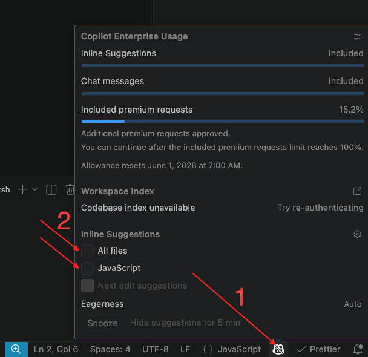

# Hướng dẫn cài đặt VS Code

# 1. Format code tự động
## Bước 1: Cài extension Prettier
1. Mở VS Code.
2. Vào tab Extensions (Ctrl+Shift+X) hoặc (Cmd+Shift+X).
3. Tìm kiếm **Prettier - Code formatter**.
4. Nhấn **Install**.

## Bước 2: Bật Format on Save
1. Mở Settings (Ctrl+,) hoặc (Cmd+,).
2. Tìm kiếm "format on save".
3. Tích vào ô **Editor: Format On Save**.

## Bước 3: Đặt Prettier làm formatter mặc định
Để đảm bảo Prettier định dạng code thay vì formatter mặc định của VS Code:
1. Trong Settings, tìm kiếm "default formatter".
2. Chọn **Prettier - Code formatter** trong danh sách.

# 2. Tắt gợi ý code tự động của Copilot
## Bước 4: Tắt Inline Suggestions
Để tắt tính năng gợi ý code tự động (inline suggestions) của Copilot:
1. Nhấn vào **biểu tượng Copilot** ở thanh trạng thái phía dưới (mũi tên 1).
2. Trong panel hiện ra, tìm mục **Inline Suggestions**.
3. Bỏ tích **All files** để tắt toàn bộ, hoặc bỏ tích từng ngôn ngữ cụ thể (ví dụ: **JavaScript**) để chỉ tắt cho ngôn ngữ đó (mũi tên 2).

